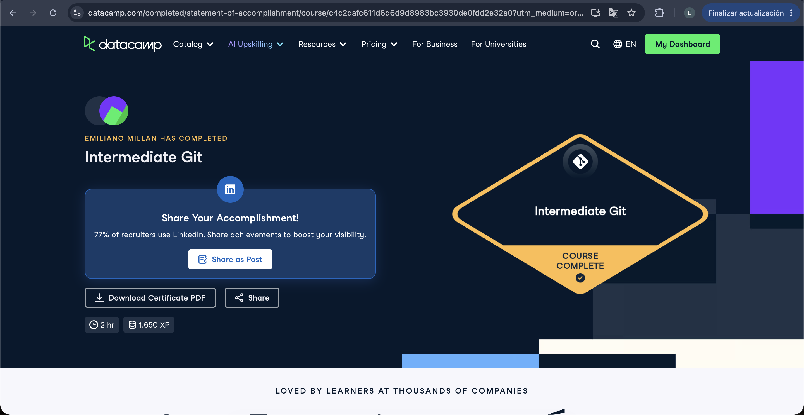

# Certificaciones de Git

## Quién soy

- Nombre: Emiliano Millán
- Usuario de GitHub: emilianomillan
- Correo con el que entraste a DataCamp: emiliano.millan@itam.mx

## Introduction to Git

Se llena en la **primera** entrega.

Fecha en que lo terminaste: 17 de septiembre de 2026

## Intermediate Git

Se llena en la **segunda** entrega.

Fecha en que lo terminaste: 17 de septiembre de 2026

## Una cosa que aprendiste y no sabías

No sabía que se podía renombrar branches desde la terminal. También descubrí git diff y me pareció bastante útil e ilustrativo para ver los cambios siempre que sea algo muy complejo de leer
