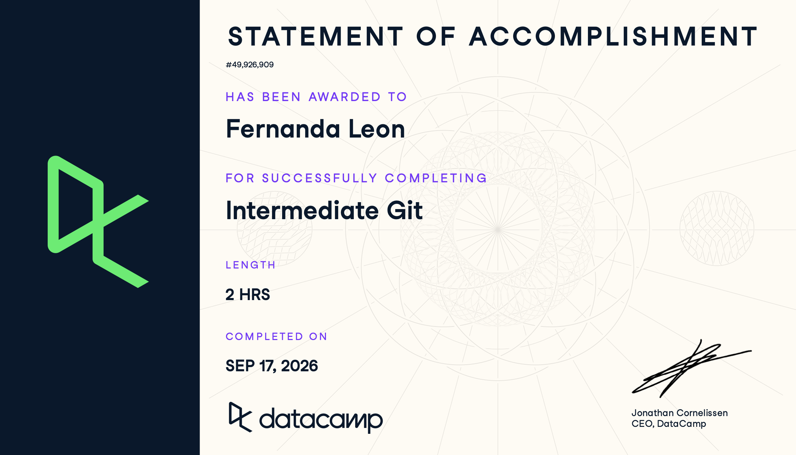

# Certificaciones de Git

Llena este archivo en **tu copia**, dentro de `estudiantes/<tu-login>/github/`.

## Quién soy

- Nombre: María Fernanda León Hernández
- Usuario de GitHub: fernandalh25
- Correo con el que entraste a DataCamp: mleonhe1@itam.mx

## Introduction to Git

Fecha en que lo terminaste: 10 septiembre 2026

## Intermediate Git

Fecha en que lo terminaste: 16 septiembre 2026

## Una cosa que aprendiste y no sabías
Los cursos me ayudaron a entender mejor conceptos vistos rápido en clase como parent commits, fast-forwdard y merges entre ramas. Pero sobre todo la práctica me hizo entender mejor el flujo de github, además de los remotes.

